# Authentication & Request Flow (PBI-11-01, documented under PBI-10-06)

Source of truth: `apps/web/src/auth/`, `apps/web/auth-bridge.html`, `apps/api/src/api/auth/`,
`src/supervisor/orchestrator.py`, `src/agents/`, `src/services/tools/`. See
`docs/Architecture/adr/0010-enterprise-authentication-entra-id.md` for the decision behind this
diagram, and `docs/Architecture/diagrams/networking-topology.md` for the network-layer view this
diagram does not repeat.

No diagram in this repository previously showed authentication — every request-flow diagram
either predated Microsoft Entra ID (PBI-11-01 through PBI-11-01D) or, in
`networking-topology.md`'s case, deliberately scopes to network topology, not the application
request path. This diagram fills that gap.

```mermaid
flowchart LR
    User(["User"])

    subgraph WEB["React SPA (apps/web) — MSAL Browser/React"]
        SignIn["Sign-in screen\n(unauthenticated)"]
        Bridge["auth-bridge.html\n(MSAL redirect bridge, PBI-11-01B)"]
        ChatUI["Chat UI\n(authenticated)"]
    end

    Entra["Microsoft Entra ID\n(/common — multi-tenant authority)"]

    subgraph API["FastAPI API (apps/api)"]
        JWT["JWT Validation\n(EntraTokenValidator: signature via JWKS,\nexpiry, audience, issuer — apps/api/src/api/auth/)"]
        Supervisor["Supervisor Agent\n(intent classification, routing, guardrails)"]
        Claims["Claims Agent"]
        Broker["Broker Services Agent"]
        Commercial["Commercial Intake Agent"]
        Tools["Tool Layer\n(deterministic, versioned Tools)"]
    end

    Synthetic[("Synthetic Data Providers\n(SYN-*/CUS-SYN-* — no real business data)")]
    Cosmos[("Cosmos DB\nconversation store, partitioned by\nauthenticated tid:oid identity")]

    User -->|"1. opens app"| SignIn
    SignIn -->|"2. loginPopup()\nOAuth2 Authorization Code + PKCE"| Entra
    Entra -->|"3. redirects to"| Bridge
    Bridge -->|"4. broadcastResponseToMainFrame()"| ChatUI
    ChatUI -->|"5. POST /chat, GET /conversations\nAuthorization: Bearer <token>"| JWT
    JWT -->|"6. valid → authenticated request\n(tid:oid identity)"| Supervisor
    JWT -.->|"invalid → 401\n(never reaches routing)"| ChatUI
    Supervisor --> Claims
    Supervisor --> Broker
    Supervisor --> Commercial
    Claims --> Tools
    Broker --> Tools
    Commercial --> Tools
    Tools --> Synthetic
    Supervisor -->|"conversation history,\nkeyed by tid:oid"| Cosmos

    classDef auth fill:#1F3A5F,color:#fff,stroke:#1F3A5F;
    class Entra,JWT,Bridge auth
```

## Reading this diagram

- **Steps 1–4** happen entirely in the browser and Microsoft Entra ID — the API is not involved
  in sign-in itself. Step 3–4 (the redirect-bridge page) exists specifically because MSAL
  Browser 5.x's popup/silent-renewal flows require a dedicated `BroadcastChannel`-based page at
  the registered redirect URI, not the SPA root — see ADR-0010's "Frontend: dedicated
  redirect-bridge page" decision (PBI-11-01B).
- **Step 5** is the only point where the SPA and API interact — every request after sign-in
  carries a Bearer token acquired via `acquireTokenSilent` (falling back to an interactive popup
  only when silent acquisition genuinely cannot succeed).
- **Step 6** is the authorization boundary: `get_current_user` (a required FastAPI dependency on
  `POST /chat`, `GET /conversations`, `GET /conversations/{id}`) either produces an
  `AuthenticatedUser` with a validated `tid:oid` identity, or the request never reaches the
  Supervisor Agent at all — there is no path from an invalid/missing token to any business logic.
- **Everything right of the JWT Validation box is unchanged by PBI-11-01** — the
  Supervisor→Agent→Tool Layer→Synthetic Data flow, and the "LLM is never the source of truth"
  principle it enforces ([ADR-0007](../adr/0007-ai-governance-boundary.md)), predate
  authentication and were not modified by it. Authentication answers "who is calling," not "what
  can be done" — the deterministic Tool-authorization boundary ADR-0007 describes is a separate,
  unchanged layer.
- Cosmos DB's partition key is the authenticated `tid:oid` identity, not a client-supplied value
  — this is the mechanism that closes the IDOR described in
  `review/02_security_review.md` §3b and `review/04_risk_register.md` (RISK-025/RISK-026).
