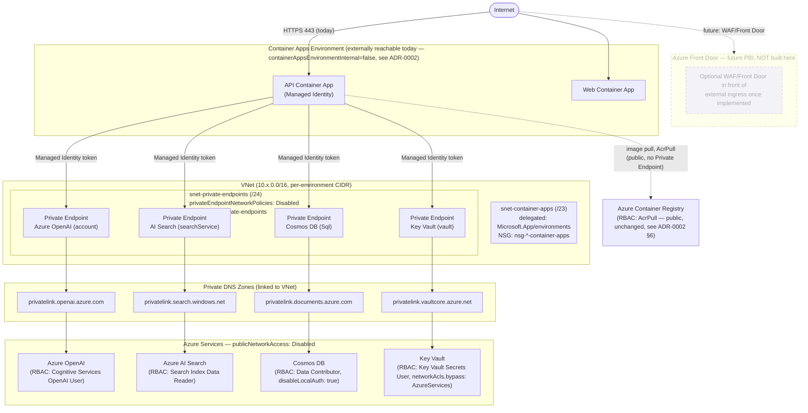

# Networking Topology (PBI-03-04)

Source of truth: `ops/bicep/main.bicep` + `ops/bicep/modules/{virtual-network,private-endpoint,
private-dns-zone,container-apps-environment,cosmos-db,ai-search,azure-openai,key-vault}.bicep`.
See `docs/Architecture/adr/0001-networking-posture-and-vnet-deferral.md` and
`docs/Architecture/adr/0002-vnet-private-endpoints-hardening.md` for the decisions behind this
diagram, including what is deliberately still out of scope (Front Door, WAF, Azure Firewall,
DDoS Plan, hub-spoke, VPN, ExpressRoute).

This is the topology when `enablePrivateNetworking = true` (staging/prod default). When
`false` (dev default), the VNet/subnets/NSGs/Private Endpoints/Private DNS Zones below simply
do not exist, and every service keeps the public, RBAC-gated posture ADR-0001 described.

## Reading this diagram

- **Solid arrows** exist today when `enablePrivateNetworking = true`. **Dashed** elements
  (Azure Front Door) are explicitly deferred — see ADR-0002.
- The API Container App reaches all four data-plane services exclusively through their Private
  Endpoints once `enablePrivateNetworking = true` — `AzureOpenAIProvider`,
  `AzureAISearchProvider`, and `CosmosConversationRepository` require **zero code change**: the
  Private DNS Zones resolve each service's existing public hostname to its private IP
  transparently.
- ACR remains on its pre-existing public endpoint (RBAC-gated via `AcrPull`) — not one of the
  four services this PBI's target architecture named for Private Link.
- Ingress stays external (`containerAppsEnvironmentInternal = false`) in every environment
  until a future PBI adds Front Door/Application Gateway — flipping it today would make the
  platform unreachable.
